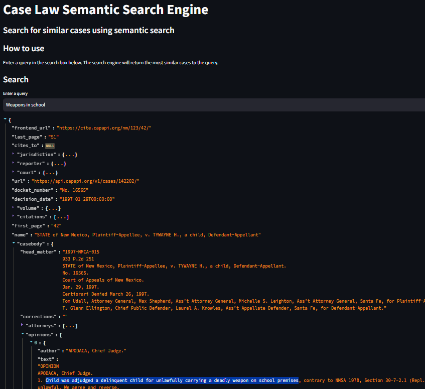

# CASELAW Semantic Search Engine

---



---

## 1. Installation
- Linux
```bash
virtualenv -p python venv
source venv/bin/activate
pip install -r requirements.txt
```
- Windows
```bash
virtualenv -p python venv
venv\Scripts\activate
pip install -r requirements.txt
```

## 2. Steps to set up Elasticsearch on Google Colab
```bash
!pip install pyngrok
```
```python
import os
from pyngrok import ngrok
from subprocess import Popen, PIPE, STDOUT
```
```python
def setup_elastic(version : str = "7.15.0") -> None:
    !wget https://artifacts.elastic.co/downloads/elasticsearch/elasticsearch-{version}-linux-x86_64.tar.gz -q
    !tar -xzf elasticsearch-{version}-linux-x86_64.tar.gz
    !rm elasticsearch-{version}-linux-x86_64.tar.gz
    !chown -R daemon:daemon elasticsearch-{version}
    !echo "xpack.security.enabled: false" >> /content/elasticsearch-{version}/config/elasticsearch.yml

    Popen(
        [f'elasticsearch-{version}/bin/elasticsearch'],
        stdout=PIPE,
        stderr=STDOUT,
        preexec_fn=lambda: os.setuid(1)  # as daemon
        )

def setup_ngrok(port : int = 9200) -> None:
    ngrok.kill()
    ngrok.set_auth_token("<NGROK_AUTH_TOKEN>")
    print(ngrok.connect(port))
```

```python
setup_elastic()
setup_ngrok()
```

## 3. Create .env file
```toml
ELASTIC_SCHEME=<ELASTIC_SCHEME>
ELASTIC_HOST=<ELASTIC_HOST>
ELASTIC_PORT=<ELASTIC_PORT>
ELASTIC_INDEX=<ELASTIC_INDEX>
NGROk_AUTH_TOKEN=<NGROK_AUTH_TOKEN>
```

## 4. Usage
```bash
streamlit run app.py
```